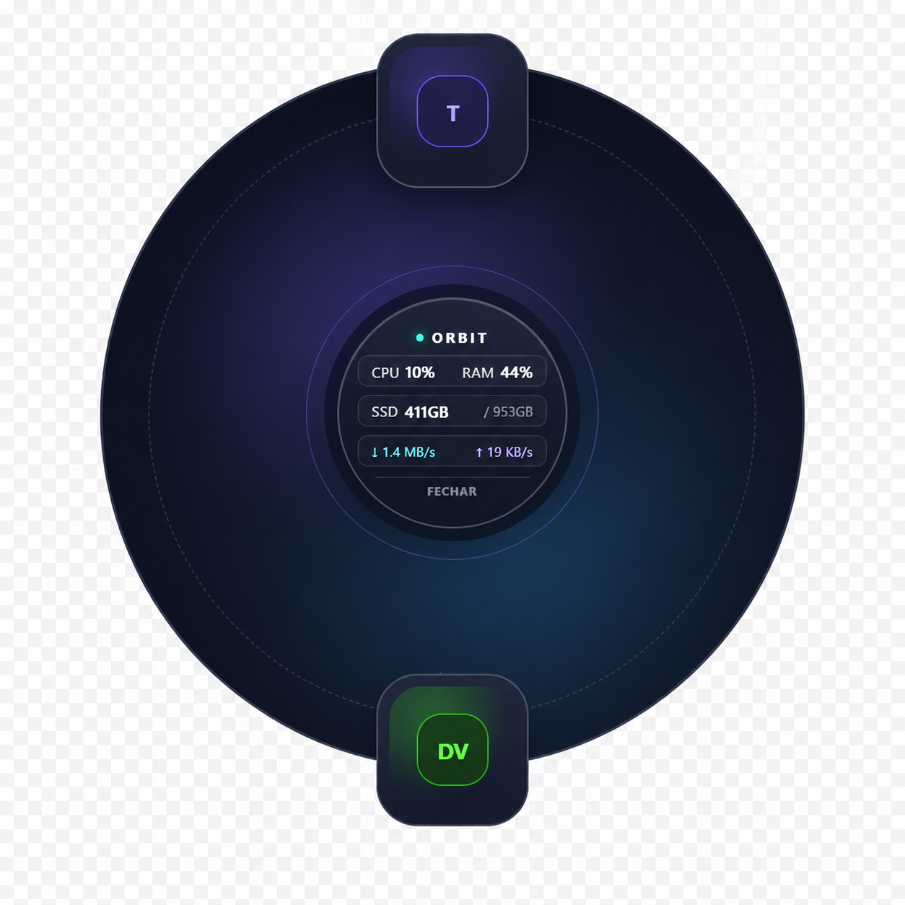
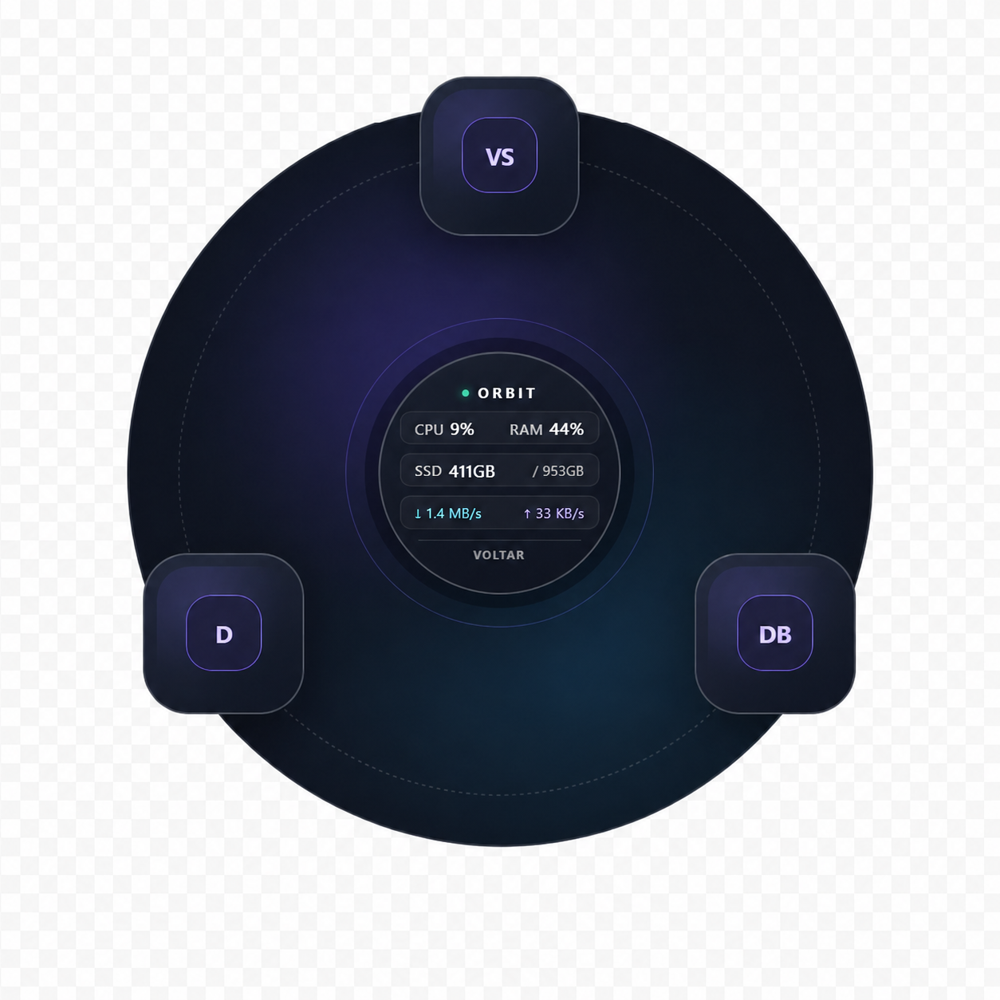
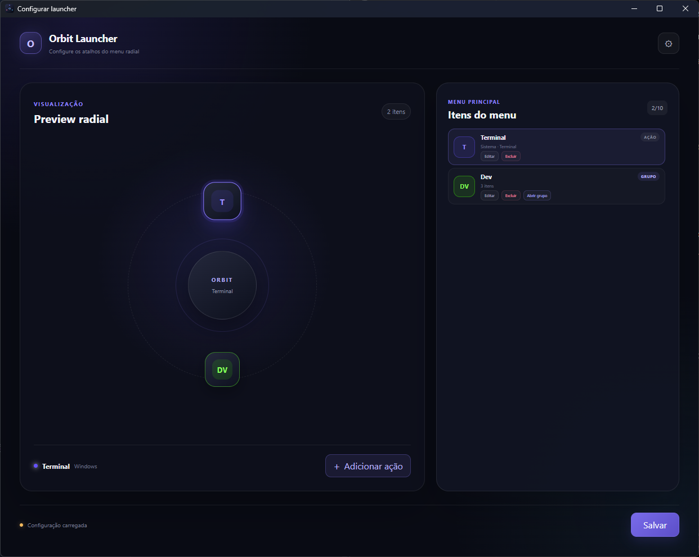
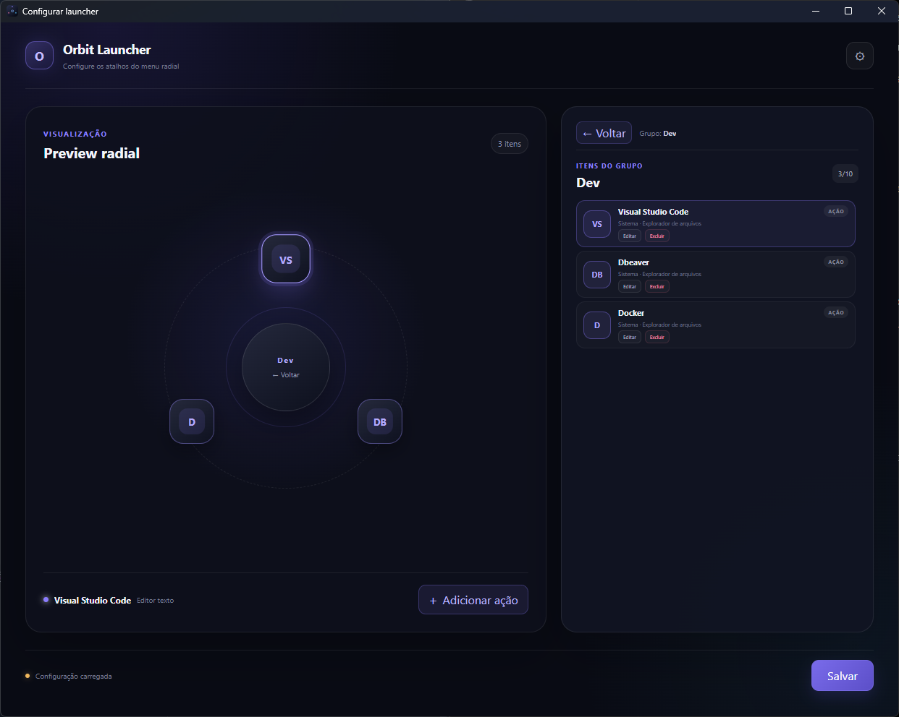
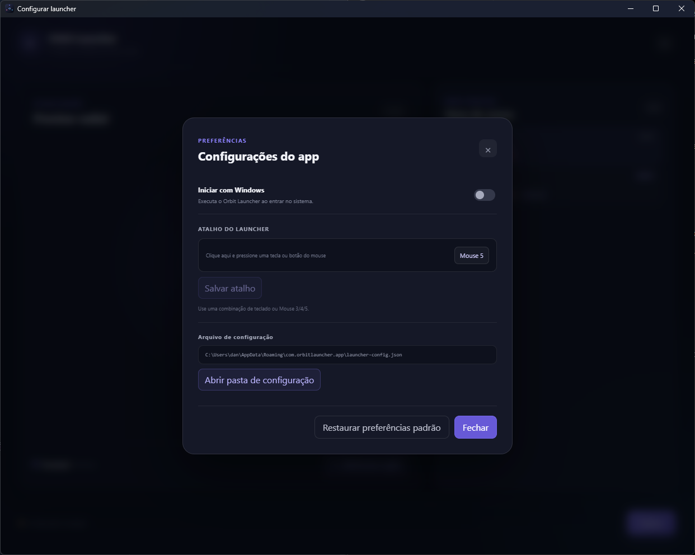

# Orbit Launcher

Um launcher radial para Windows, acionado por teclado ou mouse, com ações
personalizáveis, agrupamentos e uma interface de configuração visual.

[](https://v2.tauri.app/)
[](https://vuejs.org/)
[](https://www.rust-lang.org/)


## Preview

### Menus radiais

<p align="center">
  
  
</p>

<p align="center">
  <em>Menu principal</em> &nbsp;&nbsp;&nbsp;&nbsp;&nbsp;&nbsp;&nbsp;&nbsp;
  <em>Menu dentro de um grupo</em>
</p>

### Configuração

<p align="center">
  
  
  
</p>

<p align="center">
  <em>Tela principal</em> &nbsp;&nbsp;&nbsp;
  <em>Agrupamentos</em> &nbsp;&nbsp;&nbsp;
  <em>Preferências</em>
</p>

## Funcionalidades

- Menu radial moderno, aberto na posição atual do cursor;
- atalho global configurável por teclado;
- abertura pelos botões `Mouse 3`, `Mouse 4` ou `Mouse 5`;
- ícone na área de notificação (tray);
- janela visual para configurar, editar, excluir e reordenar os botões;
- preview radial navegável na tela de configuração;
- agrupamentos de ações, com até 10 itens por nível;
- persistência da configuração no AppData do usuário;
- status de CPU, RAM, disco e rede no centro do menu;
- abertura de programas, diretórios e URLs;
- ações rápidas para Explorador de Arquivos, terminal, Calculadora e Bloco de
  Notas;
- instalação no Windows por meio de instalador NSIS.

## Download

Baixe a versão mais recente na página de
[Releases](https://github.com/d4nprado/radial-menu/releases).

No Windows, procure o instalador NSIS com nome no formato:

```text
Orbit.Launcher_*_x64-setup.exe
```

Os arquivos **Source code (zip)** e **Source code (tar.gz)** são gerados
automaticamente pelo GitHub. Eles contêm apenas o código-fonte e não são
instaladores do aplicativo.

## Como usar

1. Instale e abra o Orbit Launcher.
2. O aplicativo permanecerá disponível na área de notificação do Windows.
3. Pelo menu do tray, escolha entre **Configurar launcher**, **Abrir menu
   radial** ou **Sair**.
4. Na configuração, adicione ações, personalize label, ícone e cor e arraste
   os botões no preview para reordená-los.
5. Nas preferências, defina um atalho de teclado ou escolha `Mouse 3`,
   `Mouse 4` ou `Mouse 5`.
6. Crie grupos no menu principal para organizar ações relacionadas.
7. Clique em **Salvar** para persistir as alterações.

## Agrupamentos

Um grupo ocupa uma posição no menu principal e contém suas próprias ações. Ao
abrir um grupo, os botões do menu atual são substituídos pelos itens internos.

- O centro do menu passa a mostrar **Voltar**;
- clicar no centro retorna ao menu principal;
- pressionar `Esc` dentro do grupo também retorna ao menu principal;
- pressionar `Esc` no menu principal fecha o launcher;
- grupos não podem conter outros grupos nesta versão;
- o menu principal e cada grupo aceitam até 10 itens.

## Desenvolvimento

### Pré-requisitos

- [Node.js](https://nodejs.org/) 20 ou mais recente;
- [Rust](https://www.rust-lang.org/tools/install) stable;
- Microsoft C++ Build Tools com as ferramentas de desenvolvimento para
  desktop em C++;
- Microsoft Edge WebView2 Runtime. Ele já acompanha o Windows 11 e versões
  atuais do Windows 10, mas pode precisar ser instalado em ambientes antigos.

### Executar localmente

```powershell
npm install
npm run tauri dev
```

### Validar o frontend

```powershell
npm run build
```

### Gerar uma build desktop

```powershell
npm run tauri build
```

## Estrutura do projeto

```text
src/                 Frontend Vue 3 e TypeScript
src/components/      Menu radial, configuração, preview e modais
src/composables/     Execução de ações e coleta dos status do sistema
src/types/           Tipos compartilhados do frontend
src-tauri/           Backend nativo em Rust e configuração do Tauri
src-tauri/src/       Comandos, persistência, tray e atalhos globais
```

Os bundles e instaladores produzidos pelo Tauri ficam em
`src-tauri/target/release/bundle`. O executável otimizado fica em
`src-tauri/target/release`.

## Configuração e dados do usuário

Durante a execução, nenhuma configuração é gravada dentro de `src/`. Os dados
ficam no diretório de aplicação do usuário em **AppData/Roaming**, normalmente
sob o identificador `com.orbitlauncher.app`.

Os principais arquivos são:

- `launcher-config.json`: itens, grupos e ordem do menu;
- `app-preferences.json`: preferências e atalho de abertura.

O caminho exato usado na máquina pode ser consultado e aberto pela tela de
preferências do aplicativo.

## Build para Windows

Para gerar o executável release e os bundles:

```powershell
npm run tauri build
```

Saídas principais:

```text
src-tauri/target/release/               Executável release
src-tauri/target/release/bundle/nsis/   Instalador NSIS
```

O processo pode levar alguns minutos na primeira execução porque o Cargo
precisa compilar as dependências Rust.

## Windows e segurança

Builds locais e releases alpha podem ser sinalizados pelo Microsoft Defender,
SmartScreen ou Smart App Control porque ainda não possuem assinatura digital.
Isso não significa automaticamente que o arquivo seja malicioso, mas sempre
confira se ele veio deste repositório.

Durante o desenvolvimento para uso pessoal, pode ser necessário permitir o
executável ou adicionar uma exclusão específica para a pasta de build. Evite
desativar globalmente as proteções do Windows.

## Status do projeto

O Orbit Launcher está em estágio **alpha experimental**, voltado principalmente
para uso pessoal. A interface, o formato da configuração e algumas
funcionalidades ainda podem mudar.

## Licença

Este projeto está licenciado sob a licença MIT. Veja o arquivo [LICENSE](LICENSE) para mais detalhes.
